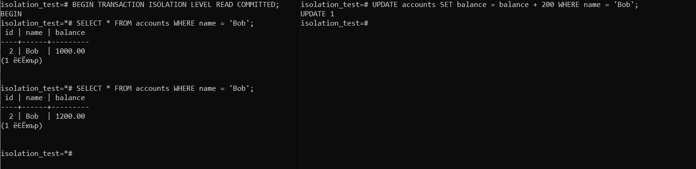
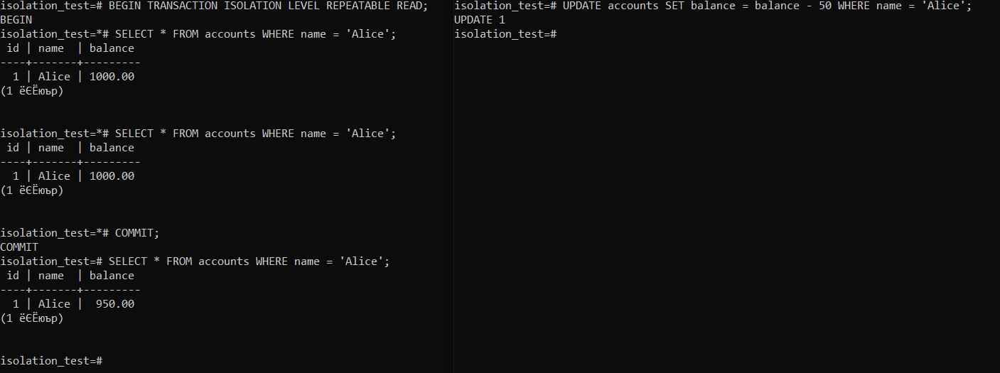
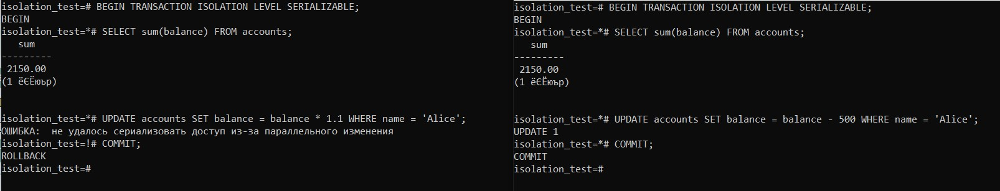

### Задание
Уровни изоляции:
Почитать про уровни изоляции и повторить https://habr.com/ru/articles/469415/


### Read Commited

```sql
BEGIN TRANSACTION ISOLATION LEVEL READ COMMITTED;
SELECT * FROM accounts WHERE name = 'Bob';
-- В другой сессии: UPDATE accounts SET balance = balance + 200 WHERE name = 'Bob';
SELECT * FROM accounts WHERE name = 'Bob'; -- Увидим новое значение после COMMIT другой транзакции
COMMIT;
```




### Repeatable Read

```sql
BEGIN TRANSACTION ISOLATION LEVEL REPEATABLE READ;
SELECT * FROM accounts WHERE name = 'Alice';
-- В другой сессии: UPDATE accounts SET balance = balance - 50 WHERE name = 'Alice';
SELECT * FROM accounts WHERE name = 'Alice'; -- Увидим старое значение
COMMIT;
SELECT * FROM accounts WHERE name = 'Alice'; -- Увидим новое значение
```




### Serializable Read

```sql
-- Сессия 1
BEGIN TRANSACTION ISOLATION LEVEL SERIALIZABLE;
SELECT sum(balance) FROM accounts; -- Получаем сумму 2000
-- В этот момент параллельно работает Сессия 2

-- Сессия 2
BEGIN TRANSACTION ISOLATION LEVEL SERIALIZABLE;
SELECT sum(balance) FROM accounts; -- Тоже получает 2000
UPDATE accounts SET balance = balance - 500 WHERE name = 'Alice';
COMMIT; -- Успешно фиксируется

-- Сессия 1
UPDATE accounts SET balance = balance * 1.1 WHERE name = 'Alice';
COMMIT; -- Получит ошибку сериализации (could not serialize access due to concurrent update)
-- Потому что данные, на основе которых производился расчет, уже изменились
```


